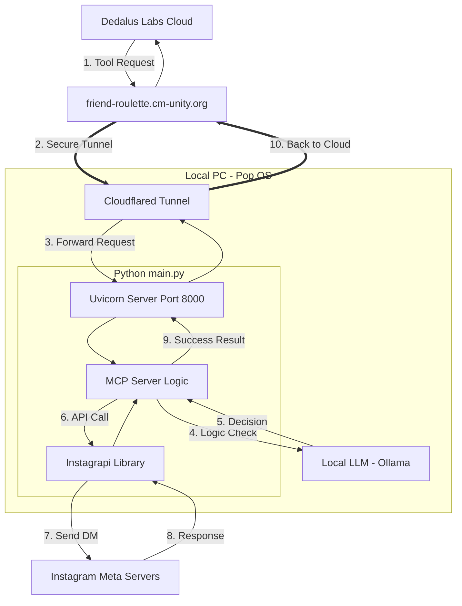

# tartanhacks2026
Our AI acts as a social conductor, turning scattered Instagram DMs into perfectly timed, interest-driven meetups

## collaboration
https://docs.google.com/document/d/180wti5qwo47JyqC9-6rBhiVy1hFe3F0L9RHfCtiCptg/edit?tab=t.0

